# Tracqer

Tracqer is a self-hosted tracker for a household vinyl collection. A small
server keeps the details of every record (label, year, format, speed, number of
discs, separate condition grades for the disc and the sleeve, and who owns it)
together with photos of the sleeve, the paper inner sleeve and each disc label.
Three clients talk to it: a web dashboard, a SwiftUI app for iPhone and iPad,
and an Objective-C app for old jailbroken iOS 6 devices.

It exists so that a shared collection (the owner field knows about "me", "dad"
and "shared") can be searched and checked from a phone or a browser, including
what state a particular copy is in, without pulling records off the shelf. It
is meant to run on a home server with a single shared password. Every API
request and response body is encrypted at the application layer with a key
derived from that password, so the record data stays private even where the
connection itself is not encrypted (photos are the exception; see
[Status and limitations](#status-and-limitations)).

The repository was called `vinyl-collection`, and that codename still appears
in the code, the database name and the web dashboard's title.

## Screenshots

All screenshots below come from this repository running locally against the
demo collection that `scripts/seed_demo.py` creates. The album titles are real,
but the photos are generated placeholders (flat colours and text), not real
cover art.

### Web dashboard

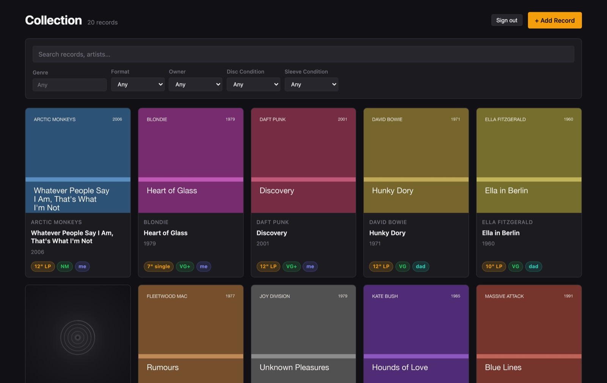
*The collection grid, with search and filters for genre, format, owner and disc or sleeve condition.*

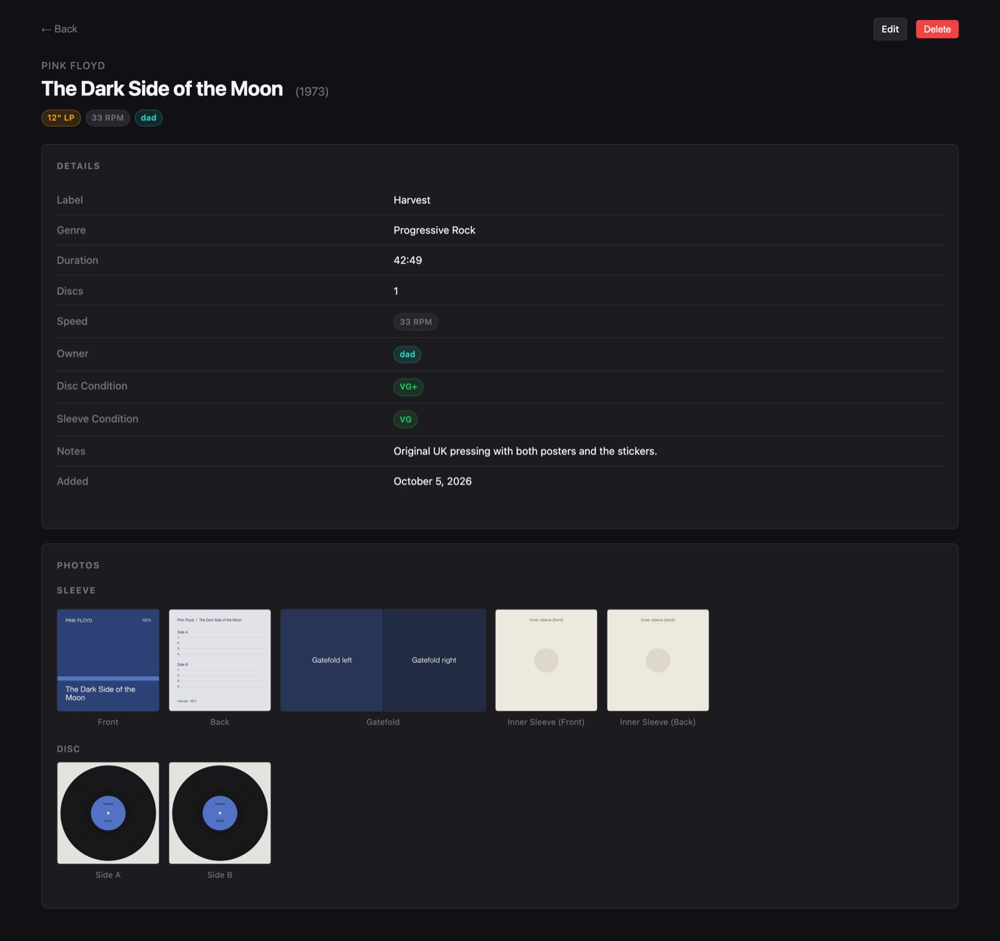
*A record's details and its photo slots: front, back, gatefold, inner sleeve and both sides of each disc.*

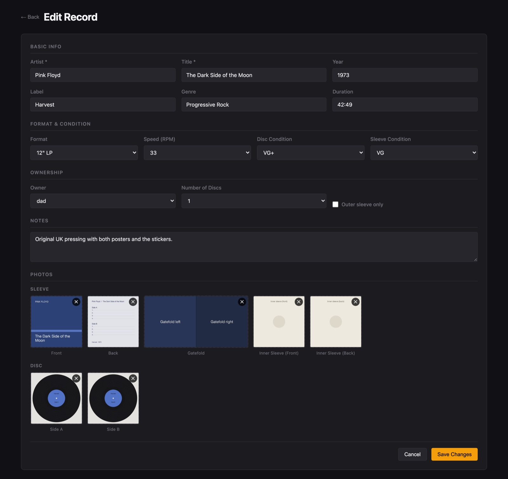
*Adding or editing a record. Photo slots follow the number of discs and the "outer sleeve only" setting.*

### iOS app (SwiftUI)

<table>
  <tr>
    <td>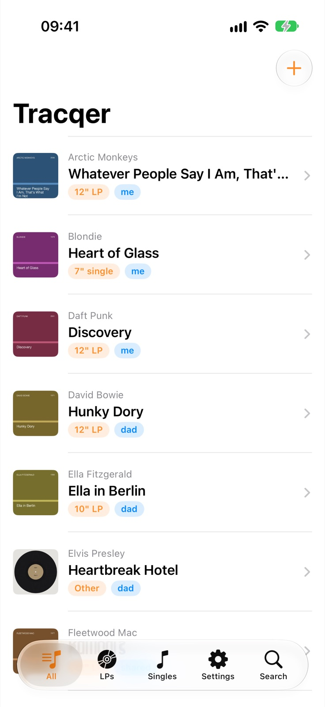</td>
    <td>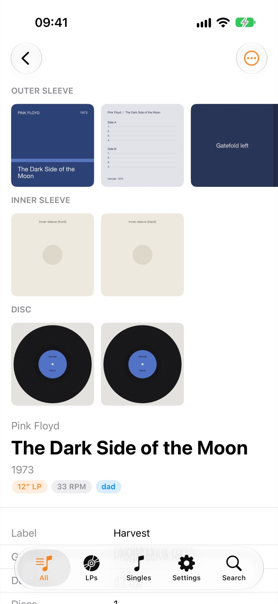</td>
    <td>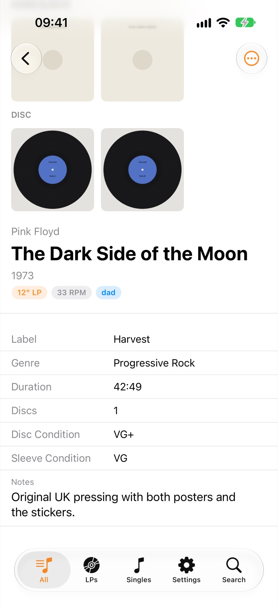</td>
  </tr>
  <tr>
    <td><em>Collection, with tabs for all records, LPs and singles.</em></td>
    <td><em>Record detail: photo strips (tap one for a full-screen, zoomable view).</em></td>
    <td><em>Record detail: metadata and notes.</em></td>
  </tr>
  <tr>
    <td>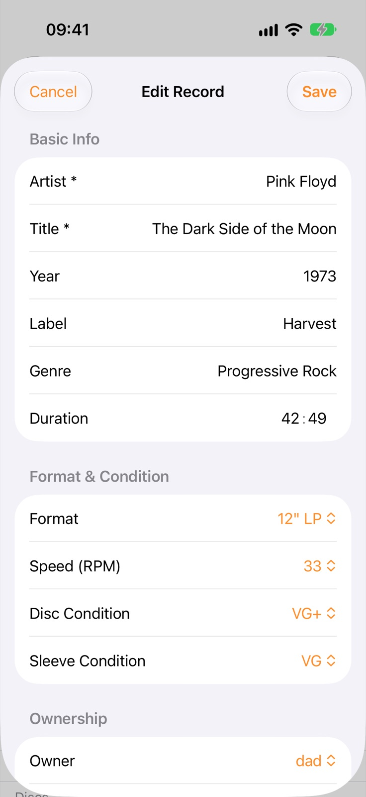</td>
    <td>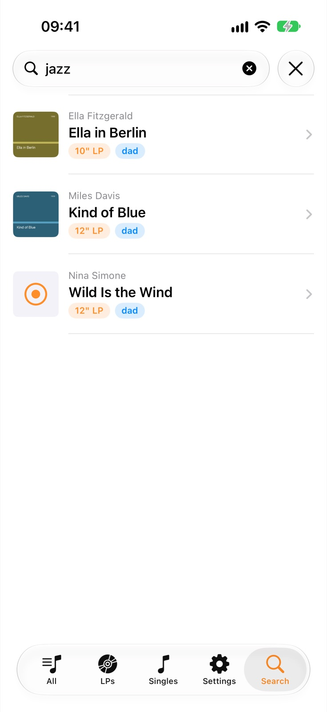</td>
    <td>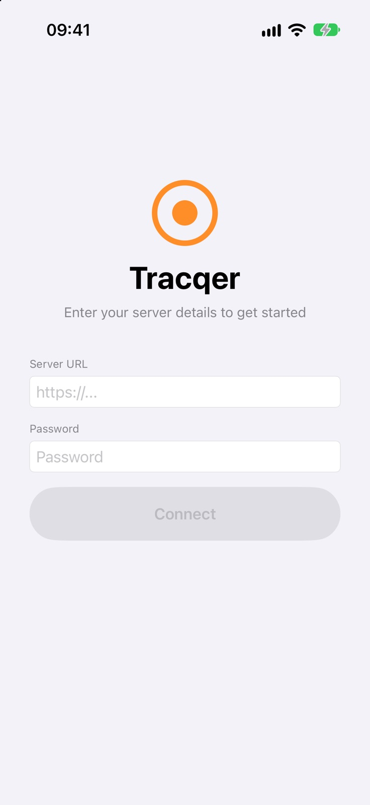</td>
  </tr>
  <tr>
    <td><em>Editing a record.</em></td>
    <td><em>Search across artist, title, label, genre and notes.</em></td>
    <td><em>Sign-in: server URL and the shared password.</em></td>
  </tr>
</table>

The iOS 6 client has no screenshots here: it only builds with Xcode 5.1.1 and
the iOS 6.1 SDK on OS X Mountain Lion, so it was not built for this README.

## Features

- Records with title, artist, year, label, genre, duration, notes, format
  (12" LP, 10" LP, 12" single, 7" single, other), speed (33, 45, 78), number
  of discs (1 to 4) and an owner (me, dad or shared).
- Separate Goldmine-style grades (M, NM, VG+, VG, G+, G, F, P) for the disc and
  the sleeve.
- Photo slots per record: sleeve front and back, a 2:1 gatefold spread, the
  paper inner sleeve front and back, and the label side and play side of each
  disc. The server keeps the original and makes 240, 320, 640 and 1280 px JPEG
  thumbnails, correcting EXIF rotation.
- Search across title, artist, label, genre and notes, plus filters and
  sorting in the API (the web dashboard exposes the filters).
- One shared password. Every JSON request and response is wrapped in an
  AES-256-CBC envelope; see [Architecture](#architecture).
- Web dashboard: browse, filter, add, edit and delete records and photos.
  Works on narrow screens.
- SwiftUI app (iOS 15 and later, Liquid Glass tab bar on iOS 26 and later):
  browse by All, LPs or Singles, search, add, edit and delete records, and
  attach photos from the library or the camera with cropping (photo upload
  needs iOS 16 or later).
- iOS 6 app (jailbroken iOS 6.1.3, for example an iPod touch or iPad 4):
  read-only browsing with sleeve thumbnails, photo viewing with pinch to zoom,
  and swipe to delete. Photo upload is not implemented yet and may come in a
  later release; add and edit forms are also still to do.

## Running it

### Prerequisites

- Python 3.10 or newer (tested with 3.14)
- PostgreSQL 13 or newer. The included `docker-compose.yml` runs Postgres 16 in
  Docker, which is the easiest route.
- Node.js 18 or newer for the web dashboard (tested with Node 22)
- Xcode for the SwiftUI app, and optionally
  [XcodeGen](https://github.com/yonaskolb/XcodeGen) (`brew install xcodegen`)

### 1. Database

```sh
git clone https://github.com/LBSiUK/tracqer.git
cd tracqer
docker compose up -d
```

This starts Postgres on `localhost:5432` (user, password and database are all
`vinyl`) and, on first start, applies `db/schema.sql` followed by each
migration in `db/` in order. If port 5432 is taken, run
`POSTGRES_PORT=5433 docker compose up -d` and change the port in `DATABASE_URL`.

Without Docker, create a database and apply the files in order yourself:

```sh
psql -d vinyl -f db/schema.sql
for f in db/migrate_*.sql; do psql -d vinyl -f "$f"; done
```

An existing database only needs the migrations it has not had yet.

### 2. API

```sh
cp .env.example .env          # then set PASSWORD (and DATABASE_URL if needed)
python3 -m venv .venv
source .venv/bin/activate
pip install -r requirements.txt
uvicorn api.main:app --host 0.0.0.0 --port 8000
```

`curl http://localhost:8000/ping` should answer `{"status":"ok"}`. Photos are
stored under `PHOTOS_DIR` (`photos/` by default, git-ignored). Changing
`PASSWORD` changes the key, so every client has to sign in again.

To fill an empty server with the demo collection used in the screenshots:

```sh
python scripts/seed_demo.py --url http://localhost:8000 --password changeme
```

It refuses to run if the collection already has records, unless you pass
`--force`.

### 3. Web dashboard

```sh
cd web
npm install
npm run dev
```

Open http://localhost:5173 and sign in with `http://localhost:8000` and your
`PASSWORD`.

To serve the dashboard from the API instead, run `npm run build` in `web/`.
When `web/dist` exists, the API serves it at `/` (restart uvicorn after the
first build).

Browsers only provide the Web Crypto API on HTTPS pages and on `localhost`, so
the dashboard cannot sign in when opened over plain HTTP from another machine.
For use around the house, put the API behind HTTPS (the iOS apps accept a
self-signed certificate).

### 4. iOS app (SwiftUI)

```sh
cd ios
xcodegen generate
open VinylCollection.xcodeproj
```

Pick a simulator or your device and run. In the simulator,
`http://localhost:8000` reaches an API running on the same Mac. Before running
on a device, set your own bundle identifier and team. [ios/SETUP.md](ios/SETUP.md)
describes the manual alternative to XcodeGen.

### 5. iOS 6 app

Open `ios-6/Tracqer/Tracqer.xcodeproj` in Xcode 5.1.1 with the iOS 6.1 SDK
(sideloaded) on OS X Mountain Lion, and install the build on a jailbroken
iOS 6.1.3 device. At launch it runs a crypto self-test against vectors from the
Python server; `python3 ios-6/tools/crypto_test_vector.py` regenerates them.

### Tests

```sh
python -m unittest discover tests     # envelope crypto, matches the clients' test vectors
cd web && npm run build               # type-checks and builds the dashboard
```

## Architecture

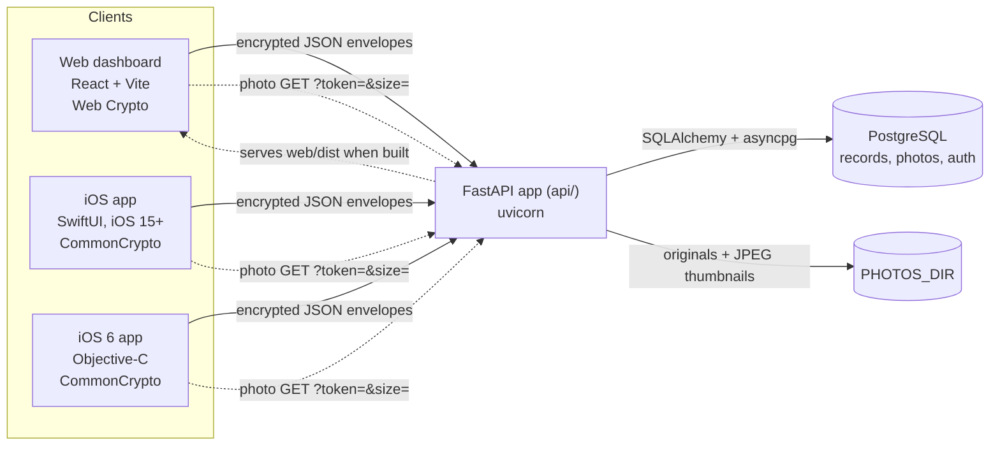

The API is a single FastAPI app. Records and photo metadata live in PostgreSQL;
image files live on disk under `PHOTOS_DIR/<photo id>/` (`original` plus
`240.jpg`, `320.jpg`, `640.jpg` and `1280.jpg`). Each record can hold one photo
per slot, and the database enforces that.

### The encrypted envelope

Nothing secret is exchanged at sign-in. The server and each client derive the
same key from the shared password on their own:

- **Key:** PBKDF2-HMAC-SHA256 of the password, salt `vinyl-collection-salt`,
  100,000 iterations, 32 bytes (AES-256). The server derives it once at startup
  from `PASSWORD`; clients derive it when you sign in and then store it
  (browser `localStorage`, `UserDefaults` on iOS).
- **Token:** the lowercase hex SHA-256 of the key, sent as
  `Authorization: Bearer <token>`. The server compares it with its own value
  in constant time. The password and the key never cross the network.
- **Envelope:** every JSON body in either direction is
  `{"iv": "<base64>", "data": "<base64>"}`, where `data` is the JSON encrypted
  with AES-256-CBC and PKCS7 padding under a fresh random 16-byte IV.

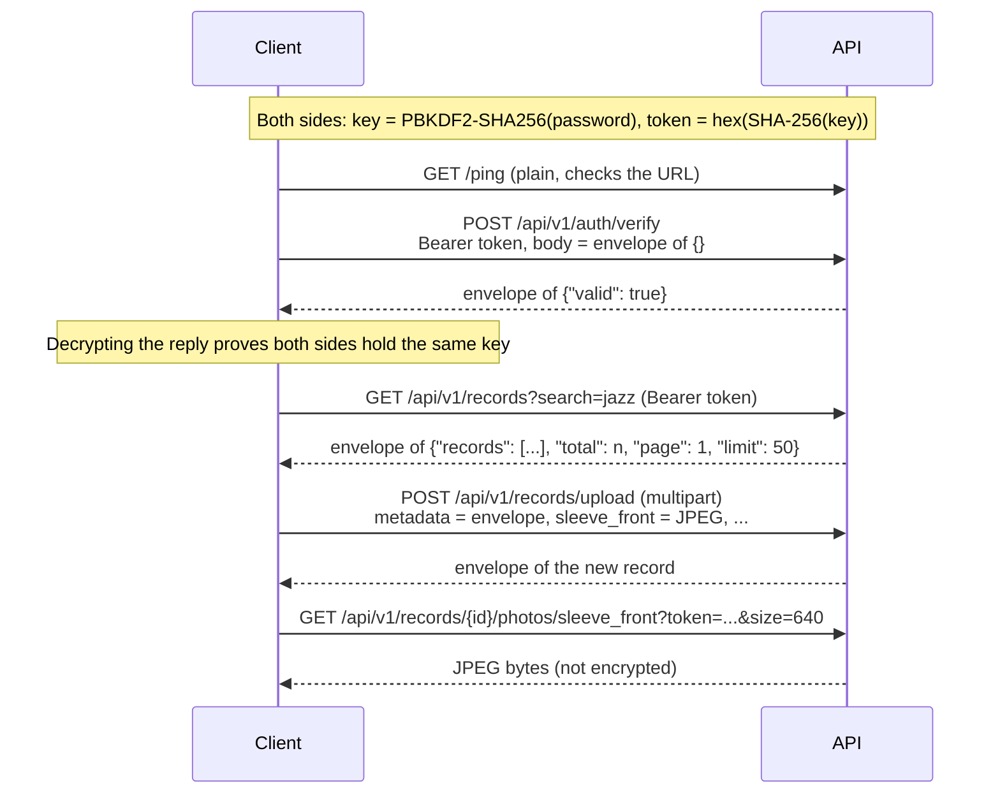

Image uploads and downloads are plain binary: uploads go as multipart form
fields next to the encrypted metadata, and downloads authenticate with the
token in the query string so that `` tags and image loaders can fetch them
directly. `DELETE` requests have no body and return `204`.

The three clients implement the same scheme with their platform's crypto
(Web Crypto in the browser, CommonCrypto and CryptoKit on iOS, CommonCrypto on
iOS 6). `tests/test_crypto.py` and the iOS 6 app's launch self-test check the
same fixed vectors, so a change on one side that breaks the others shows up.

### API endpoints

All under `/api/v1` and authenticated with the Bearer token unless noted.

| Method and path | Purpose |
| --- | --- |
| `GET /ping` | Health check, plain JSON, no auth (outside `/api/v1`) |
| `POST /auth/verify` | Confirms the password; replies with an envelope of `{"valid": true}` |
| `GET /records` | List with `search`, `artist`, `genre`, `owner`, `format`, `disc_condition`, `sleeve_condition`, `page`, `limit` (max 200), `sort` (artist, title, year, created_at), `order` |
| `POST /records/upload` | Create a record and its photos in one multipart request |
| `POST /records` | Create a record (envelope body) |
| `GET`, `PUT`, `PATCH`, `DELETE /records/{id}` | Read, replace, partly update or delete a record (deleting also removes its photo files) |
| `GET /records/{id}/photos` | List a record's photos |
| `GET`, `POST`, `DELETE /records/{id}/photos/{type}` | Sleeve photos (`sleeve_front`, `sleeve_back`, `sleeve_inner`, `inner_sleeve_front`, `inner_sleeve_back`). `GET` takes `?token=` and `size` (240, 320, 640, 1280 or original) |
| `GET`, `POST`, `DELETE /records/{id}/photos/{type}/{disc}` | Disc photos (`disc_front`, `disc_back`) for disc 1 to 4, same rules |

FastAPI's interactive docs are at `/docs`, although the bodies there are
envelopes, so they are mostly useful for reading the routes.

### Project layout

```
tracqer/
├── api/                     FastAPI backend
│   ├── main.py              app setup, CORS, startup (derives the key), serves web/dist
│   ├── crypto.py            PBKDF2 key, token, AES-256-CBC envelopes
│   ├── dependencies.py      Bearer token check, request body decryption
│   ├── models.py            SQLAlchemy models and enums
│   ├── schemas.py           Pydantic request and response models
│   └── routers/             auth, records, photos
├── db/                      schema.sql and numbered migrations
├── web/                     React + TypeScript dashboard (Vite)
│   └── src/lib/             api.ts (client), crypto.ts (Web Crypto), auth.tsx (session)
├── ios/                     SwiftUI app, project.yml (XcodeGen), SETUP.md
├── ios-6/                   Objective-C app for iOS 6.1.3 (Xcode 5.1.1 project)
│   └── tools/               crypto test-vector generator
├── scripts/seed_demo.py     demo collection with placeholder photos
├── tests/                   unit tests for the envelope crypto
├── docker-compose.yml       development PostgreSQL
├── .env.example             API settings
└── requirements.txt         Python dependencies
```

## Status and limitations

- This is a personal project for one household: there is one password and no
  user accounts. Anyone who has the password, or the token derived from it,
  has full access.
- The envelope hides the content of API traffic, but it has no message
  authentication, so it does not detect tampering. Use HTTPS as well when the
  server is reachable beyond your own network.
- Photos are not encrypted, and the photo URLs carry the token in the query
  string, so it appears in server access logs. The token does not expire;
  changing `PASSWORD` is the way to revoke it.
- Both iOS apps accept any TLS certificate so that a home server with a
  self-signed certificate works. That also means they do not detect a
  certificate swap on the network.
- The web dashboard keeps the derived key in `localStorage` until you sign
  out.
- Search uses simple substring matching. The schema already has a full-text
  `search_vector` column that the API does not use yet.
- The iOS 6 app is read-only apart from deleting records (see Features).

## Releases

- `api-v1.0`: backend
- `ios-26-v1.0`, `ios-26-v1.1`: SwiftUI client (v1.1 added iOS 15 support
  while keeping Liquid Glass on iOS 26)
- `ios-6-v1.0`, `ios-6-v1.1`, `ios-6-v1.1.1`: iOS 6.1.3 client (browse, view
  photos, delete; v1.1 added sleeve thumbnails to the list, v1.1.1 shows the
  version and build time in Settings)
